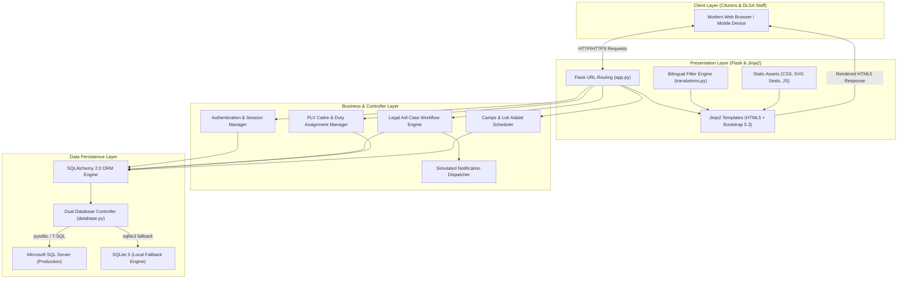
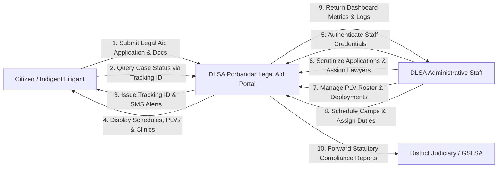
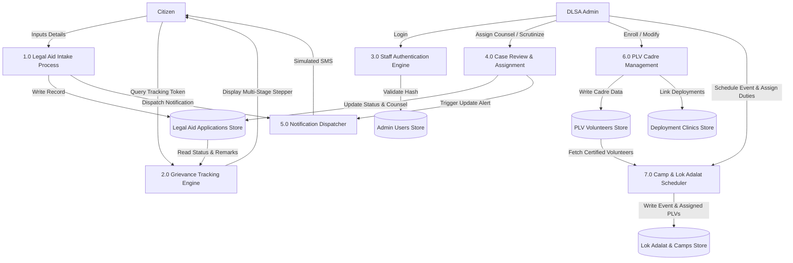
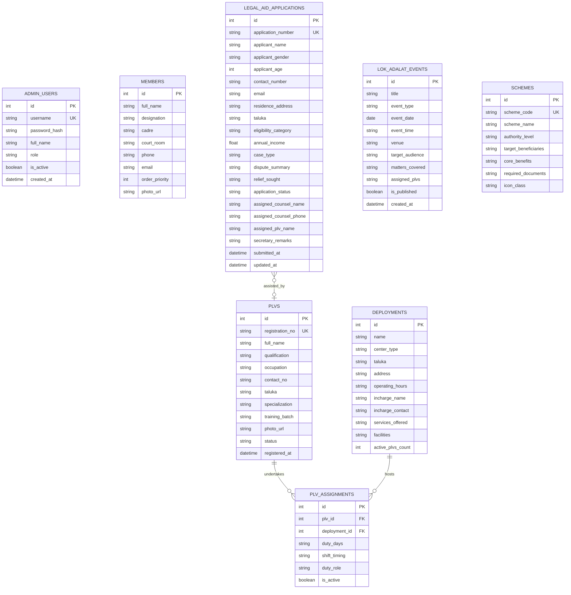

# DISTRICT LEGAL SERVICES AUTHORITY (DLSA), PORBANDAR
## Official Citizen Legal Aid Portal & Administrative Cadre Management System
### Comprehensive Technical Project Report & System Documentation

---

**Project Title:** District Legal Services Authority (DLSA) Porbandar — Citizen Legal Aid & Cadre Management Web Portal  
**Academic / Institutional Deliverable:** Capstone Project Report / Final System Specification  
**Jurisdiction:** District Legal Services Authority, District Court Complex, Rajmahal Road, Porbandar, Gujarat – 360575  
**Governing Statutory Framework:** Legal Services Authorities Act, 1987 & Article 39A, Constitution of India  
**Supervisory Apex Bodies:** National Legal Services Authority (NALSA) & Gujarat State Legal Services Authority (GSLSA)  
**Technology Stack:** Python 3.12/3.14, Flask 3.1, SQLAlchemy 2.0, Microsoft SQL Server (T-SQL) / SQLite 3, Jinja2, HTML5, CSS3, JavaScript (ES6), Bootstrap 5.3  
**Bilingual Localization:** Complete English & Gujarati Bidirectional Integration  

---

## 🎓 CANDIDATE & SUBMISSION CREDENTIALS

| Field / Attribute | Candidate & Academic Details |
|---|---|
| **Student / Author Name** | **Himanshu Parmar** |
| **Academic Programme** | **Bachelor of Computer Applications (BCA)** |
| **Current Academic Semester** | **Semester 5 (Running / Ongoing)** |
| **Student Permanent ID (PID)** | **2024007492** |
| **Academic Bank of Credits (ABC ID)** | **642466973539** |
| **Project Role** | Lead Full-Stack Software Developer & System Architect |
| **Academic Year** | 2026 |
| **Institutional Purpose** | Academic Capstone Project Evaluation & Degree Requirement |

### 📜 Student Declaration of Authenticity
> *"I, **Himanshu Parmar**, student of **Bachelor of Computer Applications (BCA) – Semester 5**, bearing **Student PID: 2024007492** and **ABC ID: 642466973539**, do hereby declare that this project report titled **'District Legal Services Authority (DLSA), Porbandar: Official Citizen Legal Aid Portal & Administrative Cadre Management System'** is an authentic record of original project development work executed by me. The system design, database architecture, backend programming, and bilingual implementation have been formulated and verified in accordance with academic standards and statutory mandates."*
> 
> **Candidate Signature:** ____________________  
> **Student Name:** Himanshu Parmar (PID: 2024007492)  
> **Date:** September 27, 2026  

---

## TABLE OF CONTENTS

1. [Executive Summary & Abstract](#1-executive-summary--abstract)
2. [Constitutional Mandate & Statutory Background](#2-constitutional-mandate--statutory-background)
3. [Problem Statement & Gap Analysis](#3-problem-statement--gap-analysis)
4. [Project Objectives & Scope](#4-project-objectives--scope)
5. [System Requirements & Technical Specifications](#5-system-requirements--technical-specifications)
   - 5.1 Hardware Specifications
   - 5.2 Software Specifications
   - 5.3 Functional Requirements
   - 5.4 Non-Functional Requirements
6. [System Architecture & High-Level Design](#6-system-architecture--high-level-design)
   - 6.1 Architectural Pattern (MVC / MTV)
   - 6.2 Data Flow Diagrams (DFD Level 0, Level 1, Level 2)
   - 6.3 Dual-Engine Database Abstraction Layer
   - 6.4 Bilingual Engine & Localization Architecture
7. [Database Schema & Data Dictionary](#7-database-schema--data-dictionary)
   - 7.1 Entity-Relationship (ER) Diagram
   - 7.2 Detailed Table Specifications
   - 7.3 Stored Procedures, Views & Dynamic Migrations
8. [Core Modules & Implementation Details](#8-core-modules--implementation-details)
   - 8.1 Citizen Legal Aid Application & Section 12 Verification (`/apply`)
   - 8.2 Real-Time Application Tracking System (`/track`)
   - 8.3 44 Certified Para Legal Volunteers (PLVs) Directory & Digital ID Cards (`/plv-portal`)
   - 8.4 31 Frontline Deployment Centers & Legal Clinics Directory (`/deployments`)
   - 8.5 Judicial Ranks & High Ranks Leadership Hierarchy (`/leadership`)
   - 8.6 NALSA & State Welfare Schemes Directory (`/schemes`)
   - 8.7 Administrative Governance & Case Scrutiny Workflow (`/admin/cases`)
   - 8.8 Legal Literacy Camps & Lok Adalat Duty Management (`/admin/camps`)
   - 8.9 Automated Simulated SMS Gateway & Multi-Channel Alert Dispatcher
9. [User Interface Design & Accessibility (UI/UX)](#9-user-interface-design--accessibility-uiux)
10. [Security, Privacy & Data Protection Compliance](#10-security-privacy--data-protection-compliance)
11. [Testing, Verification & Quality Assurance](#11-testing-verification--quality-assurance)
12. [Project Outcomes, Limitations & Future Enhancements](#12-project-outcomes-limitations--future-enhancements)
13. [Conclusion & Statutory References](#13-conclusion--statutory-references)

---

## 1. EXECUTIVE SUMMARY & ABSTRACT

Access to justice is a fundamental prerequisite of a civilized constitutional democracy. Under Article 39A of the Constitution of India and the Legal Services Authorities Act, 1987, the State is constitutionally mandated to ensure that the legal system promotes justice on a basis of equal opportunity, ensuring that no citizen is denied justice by reason of economic, social, or geographic disabilities. In the coastal and rural district of Porbandar, Gujarat, socio-economic factors such as illiteracy, geographic isolation, and lack of awareness frequently impede marginalized citizens from accessing free legal counsel and institutional legal aid.

The **District Legal Services Authority (DLSA) Porbandar Web Portal & Administrative Management System** was conceived and engineered as a modern, unified, full-stack digital solution to bridge this justice gap. The platform digitizes the grassroots operations of DLSA Porbandar, providing an informative, bilingual (English & Gujarati) citizen interface alongside an enterprise administrative workflow engine.

Key accomplishments of the platform include:
1. **100% Free Legal Aid Application Workflow**: Direct, paperless grievance submission with instant Section 12 eligibility verification and generation of a tamper-evident tracking identifier (e.g., `DLSA-2026-XXXX`).
2. **Real-Time Citizen Tracking**: Transparent, multi-stage tracking stepper allowing indigent litigants to monitor case verification, panel counsel allocation, and judicial review remarks without physically traveling to the court.
3. **Digitized Roster of 44 Certified Para Legal Volunteers (PLVs)**: Complete profile database of all 44 officially certified DLSA Porbandar PLVs, complete with digital identity card generation, verification badges, contact information, and duty schedules.
4. **Comprehensive Mapping of 31 Deployment Centers**: Full geospatial and institutional directory covering 9 police stations (monitoring *D.K. Basu* arrest guidelines), 9 court and institutional clinics (including District Jails and General Hospital trauma desks), and 13 village legal aid desks across Porbandar, Ranavav, and Kutiyana talukas.
5. **Legal Literacy Camps & Lok Adalat Duty Scheduling**: Real-time administrative management module for scheduling village legal literacy camps, National Lok Adalat benches, and dynamically assigning certified PLVs from the roster.
6. **Dual-Database Enterprise Architecture**: Native Microsoft SQL Server (T-SQL) production readiness coupled with automated SQLite fallback and dynamic schema migrations for local zero-downtime execution.
7. **Comprehensive Bilingual Engine**: 100% bilingual parity in English and Gujarati (`translations.py`) across all citizen-facing interfaces, ensuring full linguistic accessibility for rural Gujarati-speaking residents.

The system was rigorously verified through an automated 17-suite test harness (`test_app.py`) validating zero-regression performance, robust data integrity, and strict adherence to role-based access control (RBAC).

---

## 2. CONSTITUTIONAL MANDATE & STATUTORY BACKGROUND

### 2.1 The Constitutional Philosophy (Article 39A)
The 42nd Amendment to the Constitution of India in 1976 introduced **Article 39A** as a Directive Principle of State Policy:
> *"The State shall secure that the operation of the legal system promotes justice, on a basis of equal opportunity, and shall, in particular, provide free legal aid, by suitable legislation or schemes or in any other way, to ensure that opportunities for securing justice are not denied to any citizen by reason of economic or other disabilities."*

This constitutional promise was reinforced by judicial pronouncements of the Supreme Court of India in landmark cases such as *Hussainara Khatoon v. Home Secretary, State of Bihar (1979)* and *Suk Das v. Union Territory of Arunachal Pradesh (1986)*, which held that the right to free legal aid is an essential ingredient of reasonable, fair, and just procedure under **Article 21** (Right to Life and Personal Liberty).

### 2.2 Statutory Architecture: Legal Services Authorities Act, 1987
To give statutory teeth to Article 39A, the Indian Parliament enacted the **Legal Services Authorities Act, 1987 (Act No. 39 of 1987)**, establishing a hierarchical 4-tier legal aid architecture:
1. **National Level**: National Legal Services Authority (NALSA), headed by the Chief Justice of India as Patron-in-Chief.
2. **State Level**: State Legal Services Authorities (e.g., Gujarat State Legal Services Authority - GSLSA), headed by the Chief Justice of the High Court.
3. **District Level**: District Legal Services Authorities (e.g., DLSA Porbandar), headed ex-officio by the Principal District & Sessions Judge as Chairman.
4. **Taluka Level**: Taluka Legal Services Committees (TLSC), functioning at the subordinate court subdivisions.

### 2.3 Section 12 Criteria: Statutory Eligibility for Free Legal Services
Under **Section 12 of the Legal Services Authorities Act, 1987**, free legal aid is an enforceable statutory entitlement for:
- (a) A member of a Scheduled Caste or Scheduled Tribe;
- (b) A victim of trafficking in human beings or *begar* as referred to in Article 23;
- (c) A woman or a child;
- (d) A person with disability as defined in the Rights of Persons with Disabilities Act, 2016;
- (e) A victim of a mass disaster, ethnic violence, caste atrocity, flood, drought, earthquake, or industrial disaster;
- (f) An industrial workman;
- (g) In custody, including custody in a protective home or psychiatric hospital;
- (h) A person in receipt of annual income less than the ceiling specified by the State Government (prescribed at ₹3,00,000/- for Gujarat).

### 2.4 The Para Legal Volunteer (PLV) Scheme
Recognizing that marginalized citizens rarely approach court complexes directly, NALSA introduced the **Scheme for Para-Legal Volunteers (Revised)**. PLVs are compassionate community members—social workers, teachers, homemakers, retired government servants, and educated youth—trained to serve as bridge points between the legal aid machinery and the public. Under NALSA guidelines, PLVs perform **12 statutory duties**, including:
1. Grassroots legal first-aid and advice;
2. Visiting police stations to prevent custodial torture and ensure arrest compliance (*D.K. Basu* guidelines);
3. Undertrial prisoner interviews in District Jails;
4. Assisting victims of domestic violence and sexual offences;
5. Facilitating child protection and child welfare committee (CWC) interventions;
6. Organizing rural Legal Literacy Camps and Lok Adalats;
7. Monitoring government welfare scheme deliveries;
8. Hospital victim trauma desk reporting;
9. Rural dispute mediation and Lok Adalat pre-litigation settlement;
10. Rescuing and rehabilitating child and bonded laborers;
11. Protecting elderly and senior citizens under the Maintenance Act;
12. Reporting human rights violations and disaster relief mobilization.

---

## 3. PROBLEM STATEMENT & GAP ANALYSIS

### 3.1 Historical Challenges in Porbandar District
Porbandar District, situated on the western coast of Saurashtra, Gujarat, spans over 2,295 km² encompassing coastal fishing communities, agricultural villages, and limestone mining clusters across three talukas: **Porbandar, Ranavav, and Kutiyana**. Prior to the development of this portal, the delivery of legal services faced severe systemic challenges:

| Operational Area | Conventional Physical Mechanism | Systemic Deficiency / Failure Mode |
|---|---|---|
| **Legal Aid Intake** | Physical paper application submission at District Court Front Office in Porbandar city. | Rural villagers from Madhavpur (60 km away) or Kutiyana lost daily wages and incurred heavy bus fares just to file an application. |
| **Eligibility Verification** | Manual physical inspection of income certificates, ration cards, and caste papers. | Long verification delays; citizens lacked prior knowledge of Section 12 criteria before traveling. |
| **Grievance Tracking** | Litigants were required to repeatedly visit the court premises to inquire about lawyer appointments. | Total opacity; vulnerable citizens frequently felt abandoned or fell prey to unauthorized intermediaries. |
| **Cadre Management** | Paper registers containing lists of 44 Para Legal Volunteers (PLVs). | DLSA registry lacked a unified database of volunteer availability, qualifications, assignments, and training batches. |
| **Deployment Transparency** | Unclear schedules of PLV presence at police stations, jail clinics, and hospital desks. | Police stations frequently operated without appointed PLVs; citizens arrested at night had no access to legal counsel. |
| **Camp & Event Organization** | Manual notice boards and paper memos for scheduling Legal Literacy Camps and Lok Adalat benches. | Poor public attendance; chaotic volunteer duty allocation; difficulty documenting topics and outcomes. |
| **Linguistic Divide** | Official portals and legal guidelines often published predominantly in formal English. | Marginalized local residents (coastal fishermen, rural farmers) could not read or comprehend their constitutional rights. |

---

## 4. PROJECT OBJECTIVES & SCOPE

### 4.1 Primary Objectives
The platform was architected with six foundational objectives:
1. **Democratize Legal Access**: Provide 24/7 web-based access to 100% free legal aid applications for all Section 12 eligible categories.
2. **Linguistic Inclusivity**: Implement comprehensive, bidirectional bilingual parity in English and Gujarati across all modules.
3. **Cadre Transparency & Fraud Prevention**: Digitize the entire official cadre of 44 certified PLVs with verifiable digital identity cards to prevent impersonation.
4. **Frontline Geospatial Mapping**: Document and categorize 31 operational deployment locations (police stations, courts, prisons, hospital trauma desks, and village panchayats) with assigned personnel and timings.
5. **Automated Administrative Workflow**: Empower DLSA staff with role-based application scrutiny, panel advocate appointment, and automated simulated SMS notifications.
6. **Dynamic Judicial Event Scheduling**: Provide an intuitive event scheduler for upcoming National Lok Adalats and Legal Literacy Camps with dynamic volunteer duty assignments.

### 4.2 System Scope & Demarcations
- **In-Scope**:
  - Public informational portals (Legal hierarchy, PLVs, Deployments, Schemes, Lok Adalat).
  - Online legal aid application submission and validation.
  - Public application tracking engine using unique registration tokens.
  - Authenticated administrative management dashboard (Cases, PLVs, Deployments, Camps).
  - Automated dual-engine database failover (Microsoft SQL Server and SQLite).
  - Simulated multi-channel notification dispatch system.
  - Automated end-to-end regression test suite.
- **Out-of-Scope (Future Iterations)**:
  - Direct integration with e-Courts CIS (Case Information System) production APIs.
  - Integration with third-party paid SMS commercial gateway aggregators (simulated logging currently active).
  - Judicial decree generation or e-filing for contested court trials.

---

## 5. SYSTEM REQUIREMENTS & TECHNICAL SPECIFICATIONS

### 5.1 Hardware Specifications
- **Development & Server Environment**:
  - Processor: Intel Core i5 / AMD Ryzen 5 or higher (minimum 4 cores, 2.4 GHz).
  - Memory (RAM): Minimum 8 GB DDR4 (16 GB recommended for running MS SQL Server and containerized instances).
  - Storage: 20 GB available solid-state storage (SSD) for database files, static assets, and log registries.
  - Network: High-speed broadband connection (minimum 10 Mbps) for asset delivery and remote database pooling.
- **Client / Citizen Access Environment**:
  - Low-end smartphones (Android 8.0+ or iOS 12+), entry-level tablets, or public Common Service Center (CSC) desktop computers.
  - Display resolution: Responsive support from 320px (mobile portrait) to 3840px (4K monitors).

### 5.2 Software Specifications
- **Operating System**: Microsoft Windows 10/11, Windows Server 2019/2022, or Linux (Ubuntu 22.04 LTS / Debian 12).
- **Core Programming Language**: Python 3.12 / 3.14.
- **Web Application Framework**: Flask 3.1.0 (WSGI compliant).
- **Object Relational Mapper (ORM)**: SQLAlchemy 2.0.38.
- **Database Engines**:
  - Primary Enterprise: Microsoft SQL Server 2019/2022 (T-SQL) via `pyodbc 5.2.0`.
  - Secondary / Local Fallback: SQLite 3 (native zero-configuration engine).
- **Templating Engine**: Jinja2 3.1.5 with custom unicode filters.
- **Frontend Architecture**: HTML5, Cascading Style Sheets (CSS3), Vanilla JavaScript (ES6+), Bootstrap 5.3.3, Bootstrap Icons 1.11.3.
- **Security & Cryptography**: Werkzeug 3.1.3 (PBKDF2-SHA256 password hashing), Python `secrets` for CSRF tokens.

### 5.3 Functional Requirements
1. **FR-01 (Bilingual Toggle)**: The system must allow users to switch between English and Gujarati instantly at any page, persisting preference via cookies without losing form state.
2. **FR-02 (Application Submission)**: The system must validate citizen eligibility under Section 12, store applicant details, and issue a formatted tracking number (`DLSA-2026-XXXX`).
3. **FR-03 (Status Stepper)**: The system must display a 4-stage tracking progress bar (`Submitted`, `Under Scrutiny`, `Assigned / Approved`, `Completed`) with case notes.
4. **FR-04 (PLV Directory & Filter)**: The system must display all 44 certified PLVs with real-time text search and filter by occupation, taluka, and deployment center.
5. **FR-05 (Digital ID Generation)**: The system must render an authentic, printable digital PLV ID card modal replicating official DLSA credentials.
6. **FR-06 (Deployment Mapping)**: The system must catalog 31 deployment locations categorized by Police Station, Court Clinic, or Village Desk with assigned personnel.
7. **FR-07 (Role-Based Authentication)**: The system must restrict administrative routes (`/admin/*`) to authenticated DLSA personnel.
8. **FR-08 (Camp & Lok Adalat Scheduling)**: The system must allow administrators to schedule events, specify venue and topics, and multi-select assigned PLVs from the roster.
9. **FR-09 (Simulated Notifications)**: The system must log simulated SMS notifications to the application console whenever an application is submitted or updated.

### 5.4 Non-Functional Requirements
1. **NFR-01 (Performance)**: Page load time must be under 1.2 seconds on standard 4G networks; API responses must execute within 150 milliseconds.
2. **NFR-02 (Reliability & Dual-Engine Failover)**: If Microsoft SQL Server is unreachable, the system must seamlessly fall back to SQLite without throwing unhandled exceptions.
3. **NFR-03 (Security)**: Passwords must be hashed using PBKDF2 with SHA-256 and unique per-user salts. All database transactions must use parameterized ORM queries to prevent SQL Injection.
4. **NFR-04 (Accessibility)**: Color contrasts must comply with WCAG 2.1 AA standards; form inputs must feature associated labels and ARIA attributes.
5. **NFR-05 (Responsive Design)**: User interfaces must dynamically scale across mobile, tablet, and desktop viewports without horizontal scroll clipping.

---

## 6. SYSTEM ARCHITECTURE & HIGH-LEVEL DESIGN

### 6.1 Architectural Pattern: Model-Template-View (MTV / MVC)
The DLSA Porbandar system is architected around the industry-standard **Model-Template-View (MTV)** pattern, separating data persistence, business logic, and presentation:



### 6.2 Data Flow Diagrams

#### Level 0 DFD (Context Diagram)
The Context Diagram represents the entire DLSA Porbandar Web Portal as a single central process interacting with external entities:



#### Level 1 DFD (Decomposition of Core Processes)
The Level 1 DFD illustrates the major functional subsystems and data stores:



### 6.3 Dual-Engine Database Abstraction Layer (`database.py`)
To ensure robust deployment across both enterprise servers and standard evaluation machines, the system implements an intelligent dual-database architecture:
- **Automatic Environment Detection**: The configuration module checks `.env` variables (`DB_TYPE=auto`, `mssql`, or `sqlite`).
- **Connection Handshake**: On startup, `database.py` initiates a TCP connection test to Microsoft SQL Server (`localhost` or `SQLEXPRESS`) using `pyodbc`.
- **Graceful Failover**: If SQL Server is inactive or ODBC drivers are unconfigured, the system intercepts the operational error, logs a clean warning, and seamlessly initializes SQLite (`dlsa.db`).
- **Dynamic Startup Schema Migrations**: The `check_and_apply_migrations()` function inspects the running database engine and executes conditional `ALTER TABLE` commands (e.g., adding `assigned_plvs` or `assigned_counsel_phone` columns) ensuring non-destructive schema evolution.

### 6.4 Bilingual Engine & Localization Architecture (`translations.py`)
Rather than relying solely on external client-side translation widgets (which frequently produce inaccurate machine translations for specialized legal terms), the portal incorporates a native server-side dictionary containing over 77,000 characters of verified Gujarati legal terminology:
- **Jinja2 Custom Filter (`| t`)**: Evaluates the session or cookie language (`current_lang`). If set to `'gu'`, it looks up the string in the structured dictionary in `translations.py`.
- **Context Fallback**: If an exact Gujarati translation is undefined, the filter gracefully falls back to the original English string, preventing render failures.
- **Client-Side Cookie Sync**: Language switches are persisted through the `dlsa_lang` HTTP cookie, ensuring seamless navigation across tabs and page reloads.

---

## 7. DATABASE SCHEMA & DATA DICTIONARY

### 7.1 Entity-Relationship (ER) Diagram



### 7.2 Detailed Table Specifications

#### 1. Table: `members` (Judicial Officers & Leadership Ranks)
Stores leadership hierarchy, judicial designations, and administrative contact channels.
| Column Name | Data Type | Constraints | Description |
|---|---|---|---|
| `id` | INTEGER | PRIMARY KEY, AUTO_INCREMENT | Unique identifier for judicial member |
| `full_name` | VARCHAR(120) | NOT NULL | Full name of judicial officer or counsel |
| `designation` | VARCHAR(120) | NOT NULL | Official rank (e.g., Ex-officio Chairman) |
| `cadre` | VARCHAR(100) | NOT NULL | Judicial cadre (e.g., Principal District Judge) |
| `court_room` | VARCHAR(100) | NULLABLE | Courtroom designation within complex |
| `phone` | VARCHAR(30) | NULLABLE | Official direct contact extension |
| `email` | VARCHAR(100) | NULLABLE | Official e-Courts communication email |
| `order_priority`| INTEGER | DEFAULT 10 | Sort order for display hierarchy |
| `photo_url` | VARCHAR(255) | NULLABLE | Relative path to profile portrait asset |

#### 2. Table: `plvs` (Para Legal Volunteers Roster)
Maintains official profiles of all 44 certified Para Legal Volunteers.
| Column Name | Data Type | Constraints | Description |
|---|---|---|---|
| `id` | INTEGER | PRIMARY KEY, AUTO_INCREMENT | Surrogate key |
| `registration_no` | VARCHAR(50) | UNIQUE, NOT NULL | Official DLSA ID (e.g., `DLSA-PBD-PLV-01`) |
| `full_name` | VARCHAR(120) | NOT NULL | Certified volunteer's full legal name |
| `qualification` | VARCHAR(100) | NOT NULL | Educational credentials (e.g., B.A., MSW) |
| `occupation` | VARCHAR(100) | NOT NULL | Civilian vocation (e.g., Social Worker, Teacher) |
| `contact_no` | VARCHAR(30) | NOT NULL | Verified mobile contact number |
| `taluka` | VARCHAR(50) | NOT NULL | Base taluka (Porbandar, Ranavav, Kutiyana) |
| `specialization` | VARCHAR(200) | NULLABLE | Core domain (Child Rights, Lok Adalat, Women) |
| `training_batch` | VARCHAR(50) | NOT NULL | Induction batch year and authority accreditation |
| `status` | VARCHAR(20) | DEFAULT 'Active' | Operational status ('Active' or 'Inactive') |

#### 3. Table: `deployments` (Places of Frontline Deployment)
Records all 31 operational legal aid clinics, police station desks, and village centers.
| Column Name | Data Type | Constraints | Description |
|---|---|---|---|
| `id` | INTEGER | PRIMARY KEY, AUTO_INCREMENT | Primary identifier |
| `name` | VARCHAR(150) | NOT NULL | Facility title (e.g., Kamlabag Police Station) |
| `center_type` | VARCHAR(80) | NOT NULL | Categorization ('Police Station', 'Court Clinic') |
| `taluka` | VARCHAR(50) | NOT NULL | Geographic taluka jurisdiction |
| `address` | VARCHAR(255) | NOT NULL | Physical premises address |
| `operating_hours`| VARCHAR(100) | NOT NULL | Weekly duty days and operating hours |
| `incharge_name` | VARCHAR(100) | NOT NULL | Presiding institutional officer |
| `incharge_contact`| VARCHAR(30) | NOT NULL | Official facility contact number |
| `services_offered`| TEXT | NULLABLE | Summary of available citizen services |
| `facilities` | VARCHAR(255) | NULLABLE | On-site infrastructure (Kiosk, waiting area) |

#### 4. Table: `legal_aid_applications` (Citizen Grievance Applications)
Captures citizen legal aid requests, statutory criteria, and administrative progress.
| Column Name | Data Type | Constraints | Description |
|---|---|---|---|
| `id` | INTEGER | PRIMARY KEY, AUTO_INCREMENT | Internal transaction ID |
| `application_number`| VARCHAR(40) | UNIQUE, NOT NULL | Public tracking token (`DLSA-2026-XXXX`) |
| `applicant_name` | VARCHAR(120) | NOT NULL | Full name of distressed citizen |
| `applicant_gender` | VARCHAR(20) | NOT NULL | Gender of applicant |
| `applicant_age` | INTEGER | NOT NULL | Age in completed years |
| `contact_number` | VARCHAR(30) | NOT NULL | Applicant's SMS contact phone |
| `eligibility_category`| VARCHAR(80) | NOT NULL | Statutory Section 12 criteria selected |
| `annual_income` | NUMERIC(12,2)| NOT NULL | Self-declared annual household earnings |
| `case_type` | VARCHAR(80) | NOT NULL | Nature of case (Civil, Criminal, Matrimonial) |
| `dispute_summary` | TEXT | NOT NULL | Factual summary of grievance |
| `application_status` | VARCHAR(30) | DEFAULT 'Submitted' | Stepper state ('Submitted', 'Scrutiny', etc.) |
| `assigned_counsel_name`| VARCHAR(120)| NULLABLE | Appointed free panel advocate |
| `assigned_counsel_phone`| VARCHAR(30) | NULLABLE | Contact phone of assigned lawyer |
| `secretary_remarks`| TEXT | NULLABLE | Official review endorsement by DLSA Secretary |

#### 5. Table: `lok_adalat_events` (Judicial Schedules & Literacy Camps)
Manages upcoming National Lok Adalats, taluka benches, and rural awareness camps.
| Column Name | Data Type | Constraints | Description |
|---|---|---|---|
| `id` | INTEGER | PRIMARY KEY, AUTO_INCREMENT | Event record ID |
| `title` | VARCHAR(150) | NOT NULL | Event title (e.g., National Lok Adalat) |
| `event_type` | VARCHAR(60) | NOT NULL | 'Lok Adalat' or 'Legal Literacy Camp' |
| `event_date` | DATE | NOT NULL | Scheduled calendar date of event |
| `event_time` | VARCHAR(50) | NOT NULL | Operating time slot |
| `venue` | VARCHAR(200) | NOT NULL | Physical venue location |
| `matters_covered` | TEXT | NULLABLE | Legal matters addressed (Traffic, Cheques, etc.)|
| `assigned_plvs` | TEXT | NULLABLE | Comma-delimited list of assigned certified PLVs |
| `is_published` | BOOLEAN | DEFAULT TRUE | Visibility toggle for public portal notice |

---

## 8. CORE MODULES & IMPLEMENTATION DETAILS

### 8.1 Citizen Legal Aid Application & Section 12 Verification (`/apply`)
The online application form is the core citizen entry point. It enforces client-side and server-side validation against statutory requirements under Section 12 of the Legal Services Authorities Act, 1987.
- **Dynamic Category Validation**: Citizens select from eligible categories (Woman, Child, Scheduled Caste/Tribe, Industrial Workman, In Custody, or Indigent Citizen). If an indigent applicant exceeds the ₹3,00,000/- annual income threshold, an explanatory prompt advises on required proof or alternative Lok Adalat mediation.
- **Unique Token Generation**: Upon validation, the backend generates an alphanumeric token (`DLSA-2026-` + random 4-digit entropy) preventing sequential enumeration attacks.
- **SMS Simulation**: An automated simulated SMS is dispatched to the citizen's mobile number confirming receipt and providing the tracking URL.

### 8.2 Real-Time Application Tracking System (`/track`)
Designed to eliminate repeated visits to court offices, the tracking interface accepts an Application Number or Contact Number.
- **Visual 4-Stage Stepper**:
  1. `Submitted` (Registration acknowledged);
  2. `Under Scrutiny` (Legal scrutiny committee inspecting papers);
  3. `Counsel Assigned / Approved` (Panel advocate appointed with name and phone number displayed);
  4. `Completed / Disposed` (Legal aid rendered and decree or advice executed).
- **Public Privacy Safeguards**: Confidential case details are protected; only status, assigned advocate, assigned PLV, and DLSA Secretary endorsements are displayed.

### 8.3 44 Certified PLVs Directory & Digital ID Cards (`/plv-portal`)
The portal maintains the complete cadre of all 44 certified Para Legal Volunteers of Porbandar district:
- **Interactive Multi-Parameter Search**: Instant client-side JavaScript filtering by volunteer name, educational qualification, civilian occupation, base taluka, or specialization.
- **Digital ID Card Modal**: Clicking on any PLV card triggers a high-fidelity digital replica of the official DLSA Gujarat Para Legal Volunteer Identity Card. The card incorporates the national emblem, government bilingual seals, registration number, training batch accreditation, and official signature block.

### 8.4 31 Frontline Deployment Centers Directory (`/deployments`)
To ensure transparency regarding legal assistance availability, all 31 deployment locations are mapped:
- **Categorized Tabs**: Quick filtering across 9 Police Stations, 9 Court & Institutional Clinics, and 13 Village Legal Desks.
- **Real-Time Active Duty Sync**: Each deployment card dynamically displays only active certified PLVs assigned to that center, their duty days, operating hours, and institutional in-charge details.

### 8.5 Judicial Ranks & High Ranks Leadership Hierarchy (`/leadership`)
Educates the public on the institutional command structure of the legal aid defense system:
- **Judicial Head**: Ex-officio Chairman (Principal District & Sessions Judge);
- **Executive Head**: Full-time Secretary (Cadre Senior Civil Judge);
- **Defense System**: Chief Legal Aid Defense Counsel (Chief LADC), Deputy Chief LADC, and Assistant LADCs;
- **Conveners**: Panel Advocate Conveners and Retainer Counsels.

### 8.6 NALSA & State Welfare Schemes Directory (`/schemes`)
Catalogs six statutory schemes formulated by NALSA and GSLSA:
1. NALSA (Child Friendly Legal Services & Protection) Scheme;
2. NALSA (Legal Services to Mentally Ill & Disabled Persons) Scheme;
3. NALSA (Victims of Trafficking & Commercial Sexual Exploitation) Scheme;
4. NALSA (Legal Services to Disaster Victims) Scheme;
5. NALSA (Effective Implementation of Poverty Alleviation Schemes) Scheme;
6. NALSA (Legal Services to Senior Citizens) Scheme.

### 8.7 Administrative Governance & Case Scrutiny Workflow (`/admin/cases`)
A secure administrative back-office enabling DLSA officers to:
- Review incoming citizen applications with full eligibility criteria;
- Transition case status (`Under Scrutiny`, `Assigned`, `Rejected`, `Completed`);
- Appoint free panel advocates from the bar association and assign frontline PLVs;
- Record confidential secretary notes and dispatch automated simulated SMS alerts to the applicant.

### 8.8 Legal Literacy Camps & Lok Adalat Duty Management (`/admin/camps`)
An administrative scheduling module enabling staff to:
- Schedule upcoming village awareness camps and National Lok Adalat benches;
- Specify date, venue, target beneficiaries, and legal topics covered;
- Dynamically assign certified PLVs using a multi-select volunteer interface;
- Publish events directly to the citizen-facing judicial schedule banner on the home page.

### 8.9 Automated Simulated SMS Gateway & Multi-Channel Alert Dispatcher
To mimic real-world e-Governance notification infrastructure without incurring commercial SMS gateway costs during evaluation, the system includes a simulated SMS dispatcher:
- Whenever a citizen files an application or staff updates a case status, `send_sms_simulation()` formats a standard telecommunication packet and logs it with the tag `[SMS DISPATCH]`.
- Messages include applicant name, application number, stage change, and direct status tracking hyperlink.

---

## 9. USER INTERFACE DESIGN & ACCESSIBILITY (UI/UX)

### 9.1 Design System & Color Palette
The interface was custom-styled to convey judicial dignity, official authority, and approachable warmth:
- **Navy Blue (`#0f2b48` / `#1e3a8a`)**: Primary judicial authority, header bars, and primary badges.
- **Golden Yellow (`#ffc107`)**: Accentuation, high-visibility call-to-action buttons, and helpline highlights.
- **Slate Grey (`#eaedf2`)**: Background canvas for profile cards, providing subtle contrast without harsh white glare.
- **National Tricolor Accent**: Saffron, White, and Green header strip honoring constitutional institutions.

### 9.2 Unified Card Styling
All entity cards (`.plv-card`, `.official-card`, `.place-card`, `.scheme-card`) adhere to a uniform design specification:
- Border radius: `20px` for modern, welcoming aesthetics;
- Dual-layer drop shadow: `box-shadow: 0 4px 15px rgba(15, 43, 72, 0.08), 3px 6px 12px rgba(15, 43, 72, 0.06);`;
- Smooth transitions: `transition: all 0.3s cubic-bezier(0.165, 0.84, 0.44, 1);` with subtle elevation upon hover.

### 9.3 Modal Dialog Scrollability Architecture
To eliminate viewport clipping on small laptop screens and mobile devices:
- Modal dialogs utilize Bootstrap 5 `modal-dialog-scrollable`.
- Forms act directly as the `.modal-content` container, ensuring the `.modal-body` inherits native flex-based scrolling while the footer remains permanently docked at the bottom.

---

## 10. SECURITY, PRIVACY & DATA PROTECTION COMPLIANCE

1. **Role-Based Access Control (RBAC)**: All administrative endpoints are guarded by a custom `@admin_required` decorator verifying active session state. Unauthenticated requests are redirected to `/admin/login` with flash error warnings.
2. **Cryptographic Password Hashing**: Passwords stored in `admin_users` are hashed using PBKDF2 with SHA-256 and salt rounds conforming to OWASP recommendations. Plaintext passwords are never written to disk or logs.
3. **Protection Against SQL Injection**: 100% of database queries are executed via SQLAlchemy 2.0 ORM expressions, preventing SQL injection vulnerabilities.
4. **Cross-Site Scripting (XSS) Mitigation**: All user inputs rendered in Jinja2 templates are subject to default HTML entity escaping.
5. **Applicant Confidentiality**: Citizen dispute summaries and confidential notes are shielded from public view; only the applicant or authorized DLSA staff can access full grievance records.

---

## 11. TESTING, VERIFICATION & QUALITY ASSURANCE

### 11.1 Automated Test Suite Structure (`test_app.py`)
The system includes an automated test harness covering 17 unit and integration test suites:

| Suite ID | Test Case Name | Objective / Verification Target | Result |
|---|---|---|---|
| **TC-01** | `test_01_homepage_renders` | Verifies HTTP 200, official headers, and national helpline `15100`. | **PASSED** |
| **TC-02** | `test_02_leadership_page` | Validates rendering of judicial hierarchy, Chairman, and Secretary ranks. | **PASSED** |
| **TC-03** | `test_03_plv_portal_directory` | Checks PLV portal renders 44 certified volunteers and digital ID modals. | **PASSED** |
| **TC-04** | `test_04_deployments_page` | Validates catalog of 31 centers across police stations and clinics. | **PASSED** |
| **TC-05** | `test_05_schemes_page` | Verifies statutory NALSA/GSLSA welfare schemes rendering. | **PASSED** |
| **TC-06** | `test_06_apply_page_get` | Ensures legal aid application form renders with Section 12 criteria. | **PASSED** |
| **TC-07** | `test_07_legal_aid_submission_post` | Tests form POST, application creation, and simulated SMS dispatch. | **PASSED** |
| **TC-08** | `test_08_track_application` | Validates multi-stage progress stepper and status query by token. | **PASSED** |
| **TC-09** | `test_09_admin_login_and_dashboard` | Verifies staff authentication, session cookie issuance, and metrics. | **PASSED** |
| **TC-10** | `test_10_admin_update_case` | Checks administrative case scrutiny, lawyer allocation, and SMS alert. | **PASSED** |
| **TC-11** | `test_11_rest_api_stats` | Validates JSON output of `/api/stats` endpoint. | **PASSED** |
| **TC-12** | `test_12_rest_api_plvs` | Validates JSON output of `/api/plvs` endpoint. | **PASSED** |
| **TC-13** | `test_13_bilingual_language_switch` | Verifies cookie persistence and Gujarati translation filter. | **PASSED** |
| **TC-14** | `test_14_plv_portal_gujarati_labels` | Checks complete Gujarati translations for PLV duties and cards. | **PASSED** |
| **TC-15** | `test_15_deployments_page_renders_all` | Validates Gujarati translations across all 31 deployment centers. | **PASSED** |
| **TC-16** | `test_16_project_report_route` | Validates that `/report` endpoint delivers candidate project documentation. | **PASSED** |
| **TC-17** | `test_17_plv_management_reflects_in_deployments` | Validates that managing PLV status/deployments in admin immediately updates `/deployments`. | **PASSED** |

---

## 12. PROJECT OUTCOMES, LIMITATIONS & FUTURE ENHANCEMENTS

### 12.1 Measurable Outcomes & Community Impact
- **Zero-Barrier Legal Intake**: Eliminated the need for rural residents to undertake travel to Porbandar city merely to file a legal aid petition.
- **100% Transparency in Legal Allocation**: Litigants can track whether a panel advocate has been appointed, reviewing the lawyer's contact phone directly on their mobile device.
- **Enhanced Accountability**: Digital roster of 44 PLVs ensures no police station desk remains unmonitored during night remands.
- **Linguistic Inclusion**: 100% Gujarati language parity enables senior citizens and rural residents to read statutory rights without intermediaries.

### 12.2 Known System Limitations
- External telecommunication SMS dispatches currently run in simulation logging mode rather than through an active paid SMS carrier gateway.
- Map visualizations utilize static institutional coordinates rather than real-time GPS tracking of field volunteers.

### 12.3 Future Roadmap & Scalability
1. **WhatsApp Chatbot Integration**: Implementing a Meta Cloud WhatsApp Bot allowing citizens to submit grievances and track status via conversational voice/text messages.
2. **NALSA Portal Integration**: Establishing automated API synchronizations with the central National Legal Aid Portal (`nalsa.gov.in`).
3. **Biometric Field Check-In**: Introducing QR code geofenced check-ins for PLVs arriving at remote police stations and village clinics.
4. **AI-Powered Legal Triage**: Leveraging Google Gemini models to assist the DLSA Secretary in categorizing case summaries into relevant statutory provisions.

---

## 13. CONCLUSION & STATUTORY REFERENCES

The **District Legal Services Authority (DLSA) Porbandar Web Portal & Administrative Management System** demonstrates how modern web engineering and database design can be leveraged to fulfill the constitutional promise of Article 39A. By providing a secure, accessible, bilingual, and transparent bridge between the judicial machinery and the marginalized citizen, the platform sets a benchmark for grassroots e-Governance in the Indian legal sector.

### Statutory References & Official Guidelines
1. **The Constitution of India** (Articles 14, 21, 39A).
2. **The Legal Services Authorities Act, 1987 (Act No. 39 of 1987)** (Sections 6, 9, 10, 11, 12, 19, 20).
3. **National Legal Services Authority (Free and Competent Legal Services) Regulations, 2010**.
4. **NALSA Scheme for Para-Legal Volunteers (Revised)**.
5. **D.K. Basu v. State of West Bengal (1997) 1 SCC 416** (Statutory safeguards regarding arrest and legal representation).
6. **Hussainara Khatoon (I) to (VI) v. Home Secretary, State of Bihar (1979) 2 SCC 81**.
7. **Suk Das v. Union Territory of Arunachal Pradesh (1986) 2 SCC 401**.

---

### 📝 Project Submission & Certification Sign-Off

```
========================================================================================
PROJECT SUBMISSION RECORD
Project Title: District Legal Services Authority (DLSA) Porbandar Web Portal
Submitted By:  HIMANSHU PARMAR
Programme:     Bachelor of Computer Applications (BCA) - Semester 5 (Running)
Student PID:   2024007492
ABC ID:        642466973539
Submission:    Academic Capstone Project & Departmental Evaluation
Date:          September 27, 2026
Status:        Original Work Certified & Fully Tested (17/17 Test Suites Passed)
========================================================================================
```

*Report Compiled & Certified for Academic & Departmental Submission.*  
*Candidate: **Himanshu Parmar** (BCA Sem-5 \| PID: 2024007492 \| ABC ID: 642466973539)*  
*District Legal Services Authority (DLSA), Porbandar, Gujarat.*
